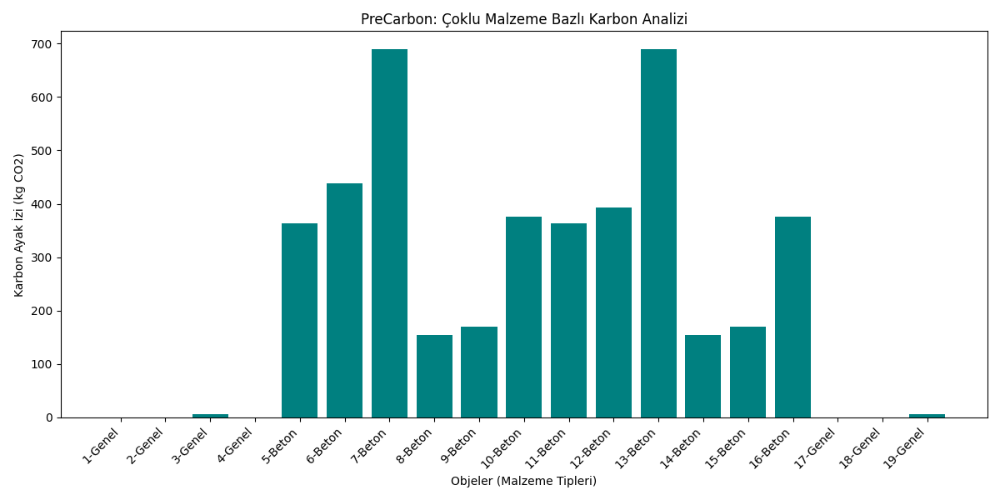

# 🌍 PreCarbon: AI-Powered Early-Stage Carbon Prediction Tool

**PreCarbon**, sürdürülebilir mimari ve inşaat projeleri için IFC (Industry Foundation Classes) modellerini analiz ederek, projenin henüz başında karbon ayak izini tahmin eden bir mühendislik aracıdır.

## 🚀 Özellikler
- **Geometrik Analiz:** IFC modellerindeki objelerin hacimlerini Bounding Box yöntemiyle otomatik hesaplar.
- **Akıllı Malzeme Tahmini:** Obje isimlerinden (Beton, Çelik, Cam, Ahşap) malzeme türünü tahmin eder ve ilgili emisyon katsayılarını uygular.
- **Görsel Raporlama:** Analiz sonuçlarını sütun grafikleri (`Matplotlib`) ile görselleştirir.
- **Kullanıcı Dostu Arayüz:** `Tkinter` tabanlı dosya seçme arayüzü ile teknik olmayan kullanıcılar için kolaylık sağlar.

## 🛠️ Kullanılan Teknolojiler
- **Dil:** Python 3.x
- **BIM Kütüphanesi:** [IfcOpenShell](http://ifcopenshell.org/)
- **Veri Görselleştirme:** Matplotlib
- **Arayüz:** Tkinter
- **Versiyon Kontrol:** Git & GitHub

## 📂 Proje Yapısı
- `app/`: Uygulamanın yönetim merkezi (GUI ve Logic).
- `src/`: IFC dosya işleme ve analiz motoru.
- `data/`: Karbon katsayıları (JSON) ve IFC modelleri.

## 📊 Örnek Çıktı

---
